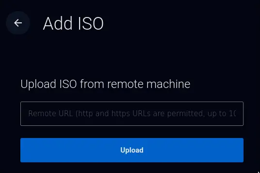
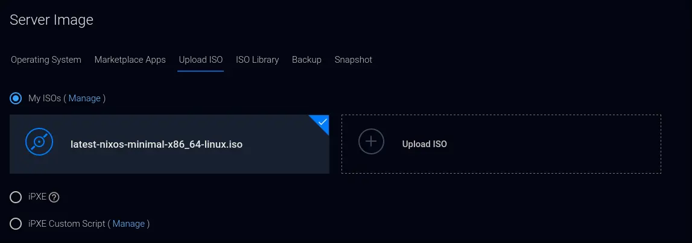
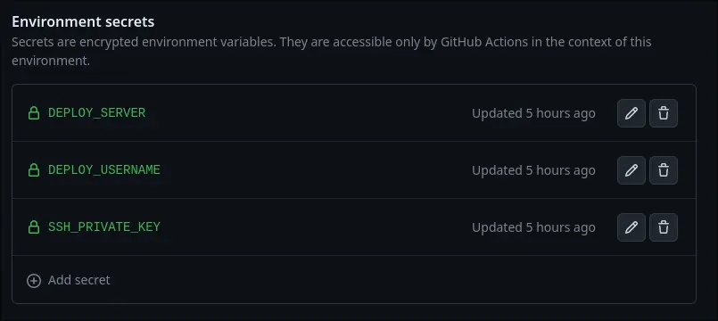

+++
title = "Niks to Nix, part 3 | Deploying to a VPS"
template = "page.html"
date = 2023-10-02
[taxonomies]
series=["Niks to Nix"]
+++

In this part we deploy our Nix configuration to a VPS on [Vultr](https://www.vultr.com/)
and setup a github action to deploy our static site when we make a change.

1. Deploy a new server instance
2. Pick a plan (I use the most basic plan)
3. Choose a location
4. In a new tab, navigate to the [upload ISO page](https://my.vultr.com/iso/add/)
5. Copy the link to the [latest ISO](https://nixos.org/download) (I use the minimal image), paste it and click upload 
6. Select that ISO you just uploaded 
7. finish the rest of the steps and click "Deploy now"
8. After the server finishes setting up, press the "view console" button to get into a terminal

## Preparing the installation

This section is roughly the same as the VM setup in the previous part with some small tweaks regarding the [specifics of Vultr](https://www.vultr.com/docs/how-to-install-nixos-on-a-vultr-vps).

Become root:
```sh
sudo su
```

The partitioning on Vultr is different because of the following:
- Vultr uses BIOS instead of UEFI
- No boot drive is needed 
- Since I use a small instance, swap space is added to make the installation work
```sh
parted /dev/vda mklabel msdos
parted -- /dev/vda mkpart primary 1MiB -GiB
parted -- /dev/vda mkpart primary linux-swap -1GiB 100%
parted /dev/vda quit

mkfs.ext4 -L ROOT /dev/vda1
mkswap -L SWAP /dev/vda2
swapon /dev/vda2
mount /dev/disk/by-label/ROOT /mnt
```

The rest is the mostly same as in the last part. 

```sh
nixos-generate-config --root /mnt
nix-shell -p git
git clone https://github.com/wjehee/.dotfiles-nix
cp /mnt/etc/nixos/hardware-configuration.nix .dotfiles-nix/hosts/HOSTNAME/
```

Perform the install, this may take a while.
```sh
cd .dotfiles-nix/
git add .
nixos-install --flake .#HOSTNAME
```

Copy the configuration onto the installed version
```sh
cd ..
cp -r .dotfiles-nix /mnt/home/admin
```

1. Change into the installed version by running: `nixos-enter`
2. Change ownership of .dotfiles-nix: `chown -R admin:users home/admin/.dotfiles-nix`
3. Set the password for the admin user: `passwd admin`
4. Create the user file for radicale: `htpasswd -B -c /etc/radicale-users USERNAME`
5. Optionally create more calendar users, by running: `htpasswd -B /etc/radicale-users USERNAME`
6. Run `exit` to leave the installed version
7. In the Vultr UI, go to settings > custom ISO and remove it, this will reboot the server

## Setting up CI

Use the following [template github action](https://gist.github.com/notthebee/2e918b62a26f1c1f22dd38baa9b6afc5) but slight adapted:

```
name: CI
run-name: Zola blog deployment
on:
  push:

jobs:
  build:
    runs-on: ubuntu-latest
    environment: deploy
    steps:
      - name: Checkout the current branch
        uses: actions/checkout@v3

      - name: Initialize the ssh-agent
        uses: webfactory/ssh-agent@v0.4.1
        with:
          ssh-private-key: ${{ secrets.SSH_PRIVATE_KEY }}

      - name: Install Zola
        run: sudo snap install zola --edge

      - name: Build the website
        run: zola build

      - name: Scan the host key
        run: mkdir -p ~/.ssh/ && ssh-keyscan -H $DEPLOY_SERVER >> ~/.ssh/known_hosts
        env:
          DEPLOY_SERVER: ${{ secrets.DEPLOY_SERVER }}

      - name: Deploy the website
        run: >-
          rsync -avx --delete --exclude '.ssh' public/ $DEPLOY_USERNAME@$DEPLOY_SERVER:/var/www/SITE_NAME
        env:
          DEPLOY_SERVER: ${{ secrets.DEPLOY_SERVER }}
          DEPLOY_USERNAME: ${{ secrets.DEPLOY_USERNAME }}
```

Create a new SSH key pair for this github action
```sh
ssh-keygen -f ~/.ssh/deploy
```
Press enter twice to not set a password.

On Github, go to the settings of your static site's repository > Environments.
Create a new environment, name it 'deploy' , then add 3 secrets as follows:


- DEPLOY_SERVER: the IP address of your VPS
- DEPLOY_USERNAME: admin
- SSH_PRIVATE_KEY: contents of the newly created SSH key at ~/.ssh/deploy

Then, in the configuration file on the server, add the contents of ~/.ssh/deploy.pub as follows:
```nix
users.users = {
	admin = {
		isNormalUser = true;
		extraGroups = [
			"docker"
		];
		openssh.authorizedKeys.keys = [
			"SSH KEY FOR LOGGING IN"
			"ADD NEW SSH KEY HERE"               # insert ~/.ssh/deploy.pub contents here
		];
	};
};
```
Then rebuild the server.

Lastly create a folder named after your static site and change the owner to the admin user:
```sh
doas mkdir -p /var/www/SITE_NAME
doas chown admin:users /var/www/SITE_NAME
```

Now, whenever you push to the repository containing your website, it will automatically update your website to reflect the changes.


