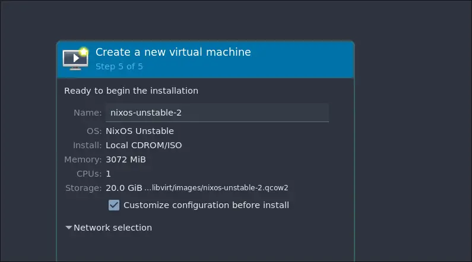
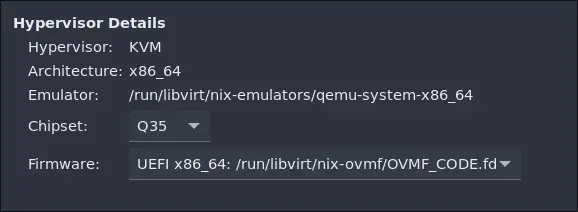

+++
title = "Niks to Nix, part 1 | Introduction and VM setup"
template = "page.html"
date = 2023-09-17
[taxonomies]
series=["Niks to Nix"]
+++

Okay, I messed up... I forgot to copy my SSH keys / add new ones to my authorized keys on the server while distrohopping.
This resulted in me losing access to my server since I only allow access with SSH keys.
But it's fine, i wanted to try and run NixOS on my server anyway, so this is the perfect excuse to do that.
Furthermore, on my old installation I used to run Dovecot + Postfix for my email but I recently came across the [Stalwart Labs mail server](https://github.com/stalwartlabs/mail-server) and wanted to try it out since it seemed very simple to use.

So in this series of articles I will set up my server again, this time running NixOS.
The name of this series comes from the dutch word "niks" which means "nothing" and since we are starting from scratch I found it appropriate.
I also happen to know that the name Nix also orginated from the same word.

This series will cover at least the following topics, but I also have a list of optional goals that I might get into in the future.

### Goals

- Setup a simple secure server, firewall, ssh keys, etc.
- Hosting my personal website
- Radicale for calendar / todos
- Mail server (stalwart-mail)
- Additional side projects

### Optional goals

- Git server
- Matrix server and bridges
- Firefox sync
- Rainloop

## Virtual machine setup

Since my server is still running and I use the services on a daily basis, my plan is to first test the configuration in a virtual machine and then deploy it once it is done.

I will be using virt-manager for running my VM's and I'll be using the [nixos minimal iso image](https://nixos.org/download).

1. Open virt-manager and create a new virtual machine.
2. Select local install media (ISO or CDROM).
3. Select the Nixos minimal ISO image.
4. Choose memory and CPU settings (default).
5. Enable storage and create a disk image (again, I leave the defaults).
6. Check the "Customize configuration before install" checkbox. 
7. Under hypervisor details change the firmware to UEFI to enable it. 
8. Click "begin installation".

